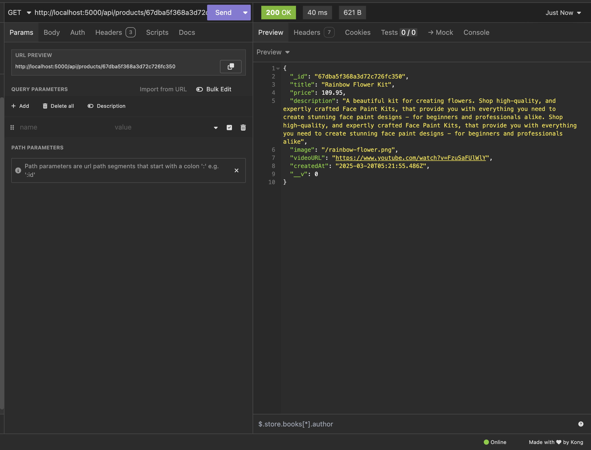
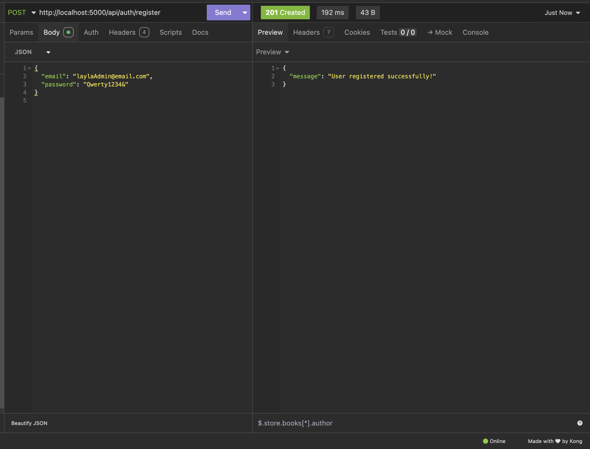

# Leanne's Collection Backend Documentation

This is the backend documentation for the MERN stack application Leanne's Collection. For a full overview of the app’s purpose, target audience, complete tech stack, data flow diagrams, architecture, user stories, wireframes, task planning, and links to the live website and GitHub repository, please refer to the root-level README.md.

This documentation focuses specifically on the backend, providing an overview of its core functionality, project structure, technologies used, API endpoints, testing setup instructions, and testing results from both development and production environments.

## Backend Overview
This backend is a RESTful API built using Node.js, Express.js, and MongoDB Atlas, structured around the MVC pattern (Model–View–Controller). It provides:

- **Mongoose models**: For defining the structure of the database
- **Controllers** For business logic
- **Routes**: For managing API endpoints 
- **Middleware**: For token validation and route protection
- **JWT's**: For authentication and secure access to admin-only features
- **Error Handling**: Custom error handling using status codes and meaningful messages 

### Key Features 

- `seeding.js` in `backend/src/utils`: Seeds the database with the product and video data required for the website to function.
- `productController.js`: Retrieves all product kits or a single kit by its ID. These are used to populate the shop page and product details on the frontend.
- `videoController.js`: Retrieves all tutorial videos their title's and Youtube URL's that are shown in the video tutorials section of the website.
- `orderController.js`: Handles customer order creation. Admin users can view all orders submitted by customers, retrieve a single order by its ID, and update an order status (fulfilled/unfulfilled).
- `authController.js`: Registers admin users (only the first two registered users are allowed to signup). It also generates and returns JWT tokens on successful login for secure authentication.
- `authMiddleware.js`: Provides route protection by validating tokens. Admin-only routes including: `getOrders`, `getOrderById`, and `updateOrderStatus` are protected by this middleware to prevent any unauthorised access.

---

## Project File Structure of Backend

```
src/
├── controllers/         # Contains all controller functions (business logic) for products, videos, user authentication, and customer orders.
├── middleware/          # Contains custom middleware functions, such as JWT token validation and admin access protection for restricted routes.
├── models/              # Defines Mongoose schemas and models for products, videos, users (admin registration), and customer orders.
├── routes/              # Contains all Express route files that connect HTTP methods (GET, POST, PATCH etc.) to their respective controllers.
├── tests/               # Contains Jest and Supertest files for automated unit and integration testing of all backend features.
├── utils/               # Utility files, including database connection setup, and seed/drop scripts to manage database content.
├── public/              # Stores static image files (eg; product kit images) that are served directly via Express to the frontend.
├── index.js             # Entry point of the backend that starts the server and connects to MongoDB using environment variables in .env.
├── server.js            # Configures the Express app: sets up middleware for JSON parsing, serves static files, and registers all route files.
├── .env                 # Stores sensitive configuration values (PORT, DATABASE_URL, JWT_SECRET) used throughout the backend.
├── package.json         # Lists project dependencies, scripts (like `start`, `seed`, `test`), and other metadata .
├── README.md            # This backend-specific documentation (you are currently reading).

```

---

## Backend Tech Stack Used

- **Node.js**: Backend runtime environment
- **Express.js**: Server framework to handle API routes
- **MongoDB Atlas**: for Cloud-hosted NoSQL database
- **Mongoose**: ODM for defining schemas and interacting with MongoDB
- **JSON Web Token (JWT)** : For authentication and route protection
- **Bcrypt** For password hashing
- **Jest**: For Unit testing
- **Supertest**: For Integration testing

---

## Getting Leanne's Collection App Started

You can run the backend **locally** or deploy it **remotely** using **Render** together with **MongoDB Atlas**. 

---

### Option 1: Run Locally (localhost & local MongoDB)

#### 1. Install dependencies

```bash
npm install
```

#### 2. MongoDB will run locally at:

`mongodb://127.0.0.1:27017/backend`

- This is the default URL that will be used if `DATABASE_URL` is not set in `.env`.


#### 3. Seed the database (Products & Videos)

```bash
npm run seed
```

- This uploads the product kits and video tutorials to the database.

#### 4. Start the server

```bash
npm start
```

#### 5. The backend will run on PORT:
  
`http://localhost:8008`

- Unless otherwise specified in your `.env` file.


#### 6. Drop the entire database (if finished testing)

```bash
npm run drop
```

---

### Option 2: Run Remotely (MongoDB Atlas & Render) 

#### 1. Create a .env file in the backend folder with these variables:

```
PORT=5000
DATABASE_URL=your-mongodb-atlas-connection-string 
JWT_SECRET=your_secret_key
```

#### 2. Set up MongoDB Atlas

- Sign up on: https://www.mongodb.com/atlas/database
- Create a free cluster
- Allow connections from your own IP address or `0.0.0.0/0` 
- Copy your connection string and paste it as the value for your `DATABASE_URL` in your `.env` file.

#### 3. Deploy Backend remotely to Render:

- Sign up on: https://render.com 
- Connect your Github Repository
- Add your `.env` variables in the Render dashboard
- Set Build command: `npm install`
- Set Start command: `npm start`

---

## API Endpoints

- Products
  - GET /api/products – Get all products
  - GET /api/products/:id – Get a product by ID

- Videos
  - GET /api/videos – Get all videos

- Auth/Users
  - POST /api/auth/register – Register admin user (only first 2 allowed)
  - POST /api/auth/login – Login and generate JWT token

- Orders
  - POST /api/orders – Create an order (for customers)
  - GET /api/orders – Get all orders (admin only)
  - GET /api/orders/:orderId – Get a single order by ID (admin only)
  - PATCH /api/orders/:id/status – Toggle order status (Unfulfilled/fulfilled) (admin only)


## Testing

This project includes both **automated tests** (unit & integration in `backend/src/tests`), and **manual testing** using Insomnia.

- **Jest**: was used for unit testing
- **Supertest**: was used for integration tests
- **Insomnia**: was used for manual testing in both development and production (screenshots).

### What was tested

- **Unit tests**: Controller logic (no status code checking)  
- **Integration tests**: Route testing including status codes, data, and error responses
- **Coverage**: 90% test coverage was achieved on all backend files.

### Screenshot of code testing coverage in terminal.


### Screenshot of code testing coverage HTML report generated.


### How to Run tests, show code coverage, and generate a HTML report

#### 1. Navigate to backend folder

```bash
cd src/backend
```

#### 2. Run All Tests

```bash
npm run test
```

#### 3. Run Tests With Code Coverage 

```bash
npm run test-cc
```

#### 4. Run tests & generate HTML coverage report

```bash
npm run test-ccc
```

- The code coverage report generated will be created under `coverage/lcov-report/index.html`.  
Right-click and “Copy path”, then paste it into your browser to view.

---

### Manual Testing in Insomnia

#### 1. Development Testing Screenshots (local)

- **Product Routes**
  
  - Get all Products (`getProducts`), API Endpoint `GET /api/products`

  

  ---

  - Get A Single Product (`getProductById`), API Endpoint `GET /api/products/:id`

  

  ---

- **Video Routes**
  
  - Get all Products (`getVideos`), API Endpoint `GET /api/videos`

  

  ---

- **Auth Routes**
  
  - Register An Admin User (`registerUser`), API Endpoint `POST /api/auth/register`

  

  ---

  - Register A 3rd Admin User When Registration is Closed (`registerUser`), API Endpoint `POST /api/auth/register`

  

  ---

  - Login An Admin User (`loginUser`), API Endpoint `POST /api/auth/login`

  

  ---  

  - Login An Admin User That Does Not Exist (`loginUser`), API Endpoint `POST /api/auth/login`

  

  ---

  - Login An Admin User With Incorrect Password (`loginUser`), API Endpoint `POST /api/auth/login`

  

  ---

- **Order Routes**
  
  - Create An Order - Customers (`createOrder`), API Endpoint `POST /api/orders`

  

  ---

  - Get All Orders - Admin (`getOrders`), API Endpoint `GET /api/orders`

  

  ---

  - Get All Orders With No Token In Header - Admin (`getOrders`), API Endpoint `GET /api/orders`

  

  ---

  - Get A Single Order - Admin (`getOrderById`), API Endpoint `GET /api/orders/:id`

    

  ---

  - Get A Single Order With No Token In Header - Admin (`getOrderById`), API Endpoint `GET /api/orders/:id`

    

  ---

  - Change An Orders Status From Default: "Unfulfilled" to: "Fulfilled" - Admin (`updateOrderStatus`), API Endpoint `PATCH /api/orders/:id/status`

    

  ---

  - Change An Orders Status With No Token In Header - Admin (`updateOrderStatus`), API Endpoint `PATCH /api/orders/:id/status`

  

  ---

#### 2. Production Testing Screenshots (Render) 

- **Product Routes**

- **Video Routes**

- **Auth Routes**

- **Order Routes**

---
