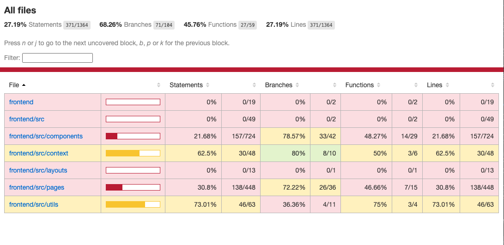

# Leanne's Collection Frontend Documentation

This is the frontend documentation for the MERN stack application Leanne's Collection. This frontend was built using React, styled with Tailwind CSS, and deployed on Netlify. For a full overview of the app’s purpose, target audience, tech stack, diagrams, wireframes, and live links, please refer to the root-level README.md.

This document provides an overview of how the frontend works, including its file structure, routing setup, deployment instructions (local and remote), and testing setup using the React Testing Library.

---

## Frontend Overview

The frontend of Leanne's Collection was built using React.js and styled with Tailwind CSS. It provides a fully responsive user interface that allows customers to browse face paint kits, watch video tutorials, and place orders. An admin login system provides access to an order management dashboard.

#### A user can perform tasks like:

- Browse all face paint kits and view more detailed product pages
- Add or remove items in an adjustable and dynamic shopping cart
- Enter their shipping details during checkout (no payment is taken)
- Be redirected to the Order Success page with a summary of their order
- VWatch tutorial videos for each kit, displayed using YouTube embeds
- See customly styled Toastify notifications for actions like adding/removing items, admin login/logout, and order success
- Send an email directly to the seller via a contact form powered by EmailJS
- If logged in as an admin, view all orders, update their status, or open single orders using protected routes (secured with JWT tokens)

### Key Features

- **HomeLayout.jsx**: Wraps most customer facing pages with a shared Header and Footer to keep layout consistent across the site.
  
- **CartTable.jsx**: Reusable component that shows cart items in a table, with optional quantity buttons depending on the page.
  
- **Header.jsx**: Navigation bar with Leanne's Collection logo, links, and a mobile friendly hamburger menu.

- **Footer.jsx**: Reusable footer with shipping details, contact info, and social media links (shown on most pages).

- **ProductCard.jsx**: Displays each product’s image, name, and price on a coloured background based on index. Shows an Add to Cart button on the ShopPage (not HomePage), and the image links to the full product details page.

- **VideoCard.jsx**: Shows YouTube tutorial videos and their titles with a coloured background based on index, used to display demo videos for each kit.
  
- **AddToCartButton**: Reusable button component that adds products to the cart and shows a toast notification the first time a product is added. Once added, it switches to quantity controls. If the quantity is reduced to 0, the Add to Cart button reappears and a remove notification is shown.

- **Contact.jsx**: Contact form powered by EmailJS that sends messages directly to the seller, with contact info and social links included.

- **Banner.jsx**: Reusable text banner component for main headings across multiple pages of app, accepts custom text as a prop.

- **LinkButton.jsx**: A styled button used to guide users between pages like Shop, About, Checkout, and more. Used throughout the app to help with navigation.

- **CalculateOrder.js**: Utility class that loops through cart items to calculate the total price using quantity and price.

- **toastUtils.js**: Handles custom toast notifications with colour styling based on the action (eg; add, remove, login, etc.).

- **backgroundColours.js**: Array of colour values used to style ProductCards and VideoCards with consistent branding.

- **CartContext.jsx**: Shares the cart data and functions across the whole app using React Context, so any component can access or update the cart.

- **localStorage**: Cart contents are saved in localStorage so they stay there even after the page is refreshed or the user returns later.

---

## Project File Structure of Frontend

```
src/  
├── components/          # Reusable components like CartTable, Banner, ProductCard, VideoCard, etc.  
├── context/             # React Context files (eg; CartContext for managing cart state) 
├── layouts/             # HomeLayout component that wraps most pages with a shared Header & Footer
├── pages/               # All pages for the site, like HomePage, ShopPage, AboutPage, TutorialsPage, etc.
├── utils/               # Helper files: toastUtils (notifications), CalculateOrder (totals), backgroundColours (kit colours)
├── App.jsx              # Sets up all frontend routes with react-router & wraps them in HomeLayout and CartProvider
├── index.css            # Tailwind CSS styles and base styling 
├── main.jsx             # Main entry point that renders the App
├── setupTest.js         # Sets up React Testing Library        
├── test/                # All frontend test files (unit & integration)
.env                     # Frontend environment variable (eg; VITE_BACKEND_API_URL)
index.html               # Contains root div, favicon, Google Fonts, and site title
netlify.toml             # Fixes routing issues for page refreshes on Netlify  
package.json             # Project dependencies, scripts for running and testing the app
postcss.config.js        # Required Tailwind config file
README.md                # This frontend-specific documentation (you are currently reading).
tailwind.config.js       # Tailwind setup and custom font settings
```
---

## Frontend Tech Stack Used

- **React.js**: For building all the pages and components on the frontend, and using Context API to manage the cart state across the app.
- **React Router DOM**: For setting up navigation and page routes
- **Tailwind CSS**: For styling and responsive design for different screen sizes
- **React Toastify**: For custom toast notifications throughout the app (eg; cart updates, form submissions, login/logout)
- **EmailJS**: To send messages directly from the contact form on the About Page
- **React Testing Library & Vitest**: Used together for unit and integration testing
- **Vite**: For running the app locally and building it
- **Netlify**: For deploying and hosting the frontend. A netlify.toml file was included to prevent page refresh errors.
- **Heroicons & Font Awesome**: For all the icons like the cart, menu, and socials
- **Favicon.io**: Used to create the Leanne’s Collection logo favicon
- **Figma**: Used to design the layout and wireframes before building

---

## Frontend Routes & Pages   

- `/` – **HomePage**: Shows an overview of the website with a hero section, preview of kits and videos, a short intro about the seller, and buttons (CTA) to guide customers to other pages.
  
- `/shop` – **ShopPage**: Displays all available products (kits) that were seeded from the backend, each with an "Add to Cart" button.
  
- `/product/:id` – **ProductPage**: Shows full details of a selected product, including a longer description and an embedded tutorial video for the kit.
  
- `/cart` – **CartPage**: Lets customers review what’s in their cart, adjust quantities, or remove items.
  
- `/checkout` – **CheckoutPage**: A form for customers to enter their shipping details (name, email, address), view their order summary, and submit the order.
  
- `/success` – **OrderSuccessPage**: Shows a confirmation message after checkout, with the customer’s order summary and shipping details returned.
  
- `/tutorials` – **TutorialsPage**: Shows all the embedded YouTube video tutorials that match the kits on the website, so customers can follow along and learn how to use them.
  
- `/about` – **AboutPage**: Gives more information about the seller and the brand, with contact info, social links, an enquiry form, and a featured video of a new kit release.
  
- `/admin/login` – **LoginPage**: Lets the admin register (only two allowed) or login to access the admin dashboard and manage orders.
  
- `/admin/orders` – **AdminOrdersPage**: Once logged in, the admin can view all customer orders and update the status (fulfilled/unfulfilled).
  
- `/admin/orders/:orderId` - **AdminOrderDetailsPage**: Lets the admin view extra details for a single order, like customer name, email, and what items were purchased.

---

## Getting Leanne's Collection App Started

You can run the frontend **locally** or deploy it **remotely** using **Netlify**.

---

### Option 1: Run Locally (localhost)

#### 1. Clone the Repository

```
git clone https://github.com/LaylaD4/LaylahDePaull_T3A2-B.git
```

#### 2. Navigate to frontend folder

```
cd src/frondend
```

#### 3. Install depenencies

```
npm install
```

#### 4. Create a .env file in the root of the frontend folder
```
VITE_BACKEND_API_URL=http://localhost:5000
```

#### 5. Start the frontend locally

```
npm run dev
```

- The app should now run at: http://localhost:5173 (if available)

---

### Option 2: Run Remotely (Deploy to Netlify) 

#### 1. Push code to Github 

```
git push origin main
```

#### 2. Set up Netlify account

- Sign up on: https://www.netlify.com
- Click **Add New Site** > **Import from Git**
- Connect your GitHub repository
- Set the build command to: `npm run build`
- Set the publish directory to: `src/frontend/dist`

#### 3. Add the environment variable (see backend docs for your Render backend URL)

```
VITE_BACKEND_API_URL=https://your-render-backend-url.onrender.com
```

#### 4. Deploy the frontend

- Make sure the netlify.toml file is in your src/frontend folder to avoid `404 errors` when refreshing pages like `/shop`, `/tutorials`, etc.

```
[[redirects]]
  from = "/*"
  to = "/index.html"
  status = 200
```

- Click **Deploy Site**

---

## Production Testing

This project includes both **automated tests** (unit & integration in `frontend/tests`) folder. **React Testing Library** and **Vitest** were used to write and run all frontend tests.

### What was tested

- **Unit tests**: 
    - `AddToCartButton`: 2 Unit tests 
    - `CartPage`: 2 Unit tests 
    - `LoginPage`: 2 Unit tests

- **Integration tests**: 
    - `AddToCartButton`: 1 Integration test 
    - `LoginPage`: 1 Integration test
    - `OrderSuccessPage`: 1 Integration test 
  
- **Coverage Summary**: A total of **6 unit tests** and **3 integration tests** were completed.

---

### Screenshot of code testing coverage in terminal.


### Screenshot of code testing coverage HTML report generated.



---

### How to Run tests, show code coverage, and generate a HTML report

#### 1. Navigate to frontend folder

```bash
cd src/frontend
```

#### 2. Run All Tests

```bash
npm run test
```

#### 3. Run Tests With Code Coverage & generate HTML coverage report

```bash
npx vitest --coverage
```

- The code coverage report generated will be created under `coverage/index.html`.  
Right-click and “Copy path”, then paste it into your browser to view.


## Client Testing – Live Production Site  

This project was tested by the client, Leanne from Leanne’s Collection (the seller). The site was deployed to Netlify and shared with her via the live production link. I asked Leanne to complete some live testing, and she provided feedback and mobile screenshots by email after exploring the site.

### Screenshot of email communication to the client


---

### Screenshot of email communication from the client


---

### Client Testing Screenshots (mobile view)


---


## Leanne's Collection Application Screenshots - Live Production Site Testing

### Desktop View

#### HomePage  


---

#### ShopPage  


---

#### ProductPage  


---

#### CartPage  


---

#### CheckoutPage  


---

#### OrderSuccessPage  


---

#### LoginPage (Reister/Login)  


---

#### AdminOrdersPage  


---

#### AdminOrdersDetailsPage  


---

#### TutorialsPage  


---

#### AboutPage  
  

---  

### Tablet View 

#### HomePage  


---

#### ShopPage  


---

#### ProductPage  


---

#### CartPage  


---

#### CheckoutPage  


---

#### OrderSuccessPage  


---

#### LoginPage (Reister/Login)  


---

#### AdminOrdersPage  


---

#### AdminOrdersDetailsPage  


---

#### TutorialsPage  


---

#### AboutPage  


---

### Mobile View 

#### Home, Home-Menu, Shop & Product Pages  


---

#### Tutorials, About, Cart & Checkout Pages  


---

#### Order Success, Login, Admin Orders & Admin Order Details Pages  


---


  
